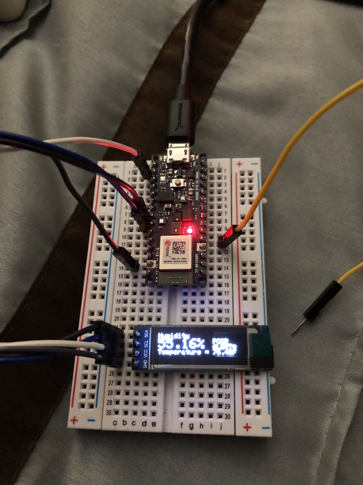

 # 3D Filament Box Humidity Monitor 

Coded By: Je'aime Powell
Inital Date: 5/29/21

## Purpose
- Sensor to live in the 3D Printer filament box to monitor filament humidity.
- Alerts during high humidity levels
- Alerts when box/enclosure open
- Beacons BLE for remote monitoring
 
## Built for/Test Equipmemt
     - Arduino Nano 33 BLE Sense
       - HTS221 Temperature and Humidity Sensor (built-in)
       - RGB LED (built-in)
         *<< NOTE!! >> LOW = ON for the LEDs
       - Switch Pin D2 -> GND (Switch Closed for Open Box Message)
         *Note: other built in sensors: Ref: https://store.arduino.cc/usa/nano-33-ble-sense-with-headers
         - LSM9DS1 - IMU
         - MP34DT05 - Mic
         - APDS9960 - Gesture/Light/Proximity
         - LPS22HB - Barometric Pressure
     - SSD1306 OLED (I2C) 128x32 
    
 ## Filament humidity level alerts 
      Humidity levels: 10% - 20% (Excellent), 20%-25% (Good),25% -35% (Fair), >35% (Poor)  
       ! PLA Humidity > 45%
       ! PETG Humidty > 45% 

## Bread Board Prototype

 
